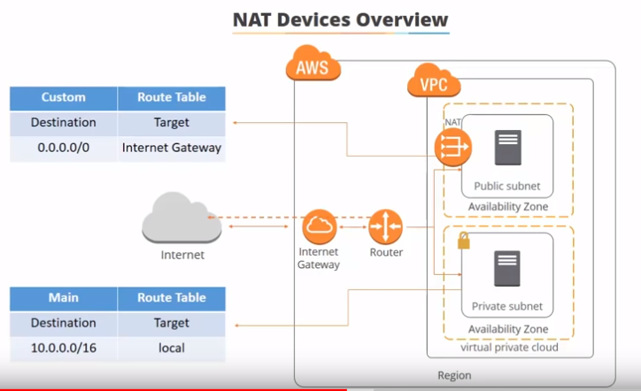
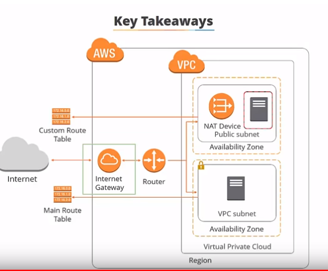
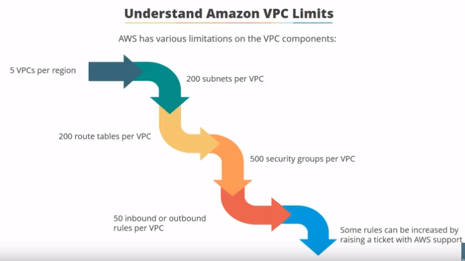
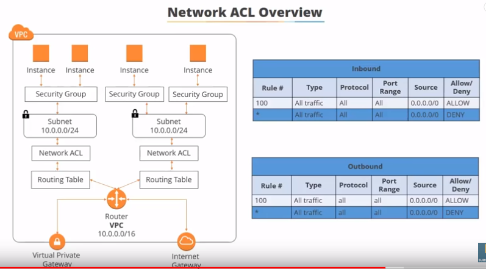

# Create A VPC on AWS

# Reference
https://youtu.be/fpxDGU2KdkA

## 1. Create VPC
Name tag:
CIDR block: 10.0.1.0/16
Tenacy: Default
## 2. Create Subnets
## 3. Internet Gateway
## 4. Route Table
## 5. NAT
## 6. Security and Network ACLs

